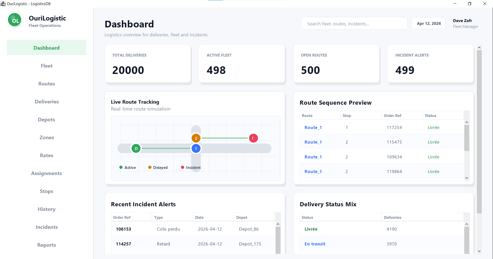
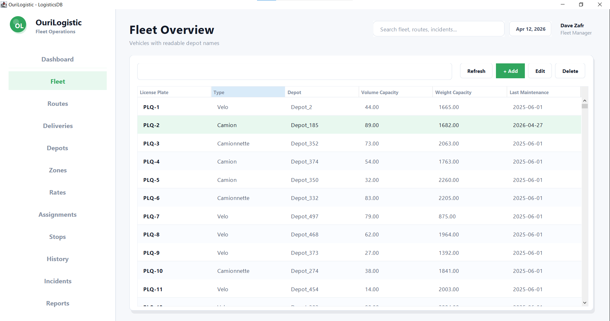
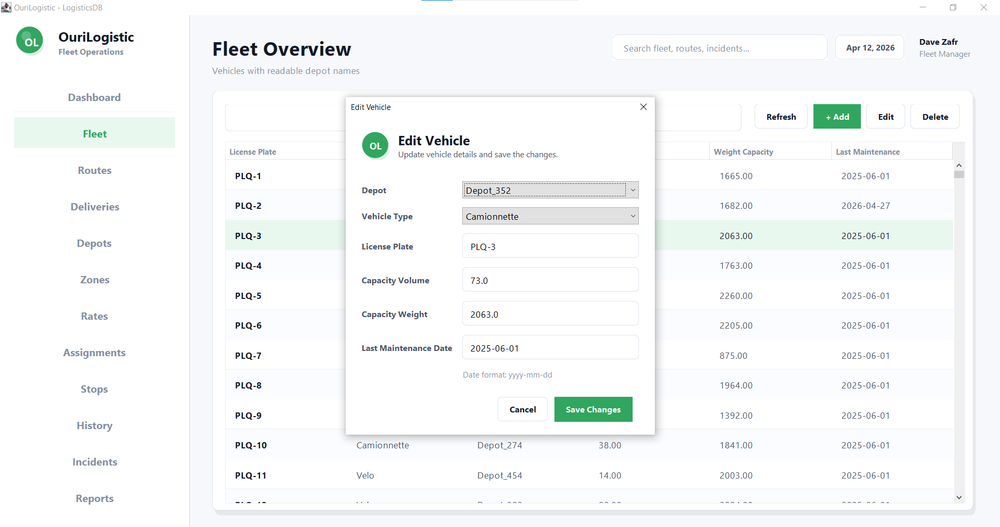
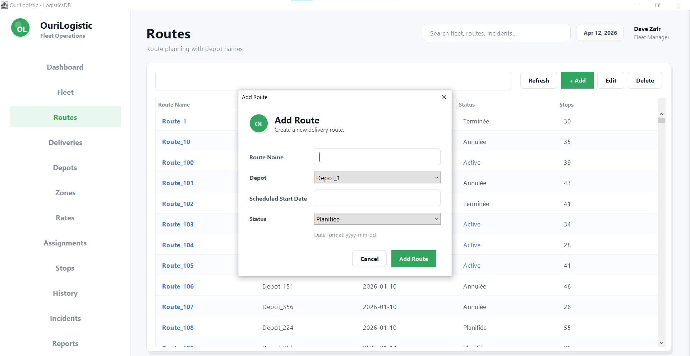
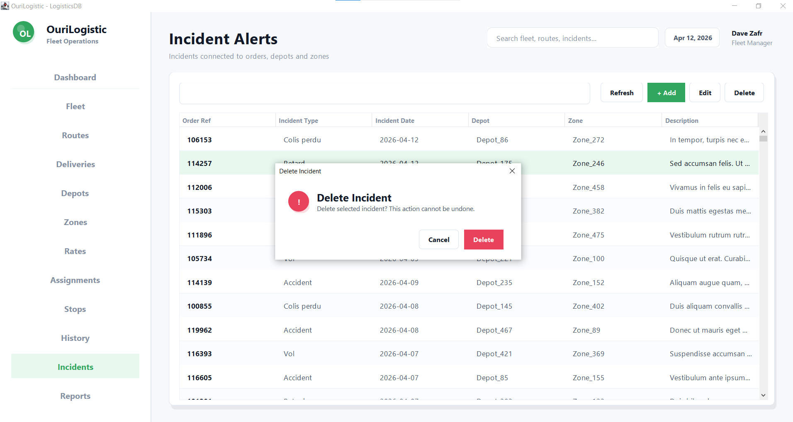
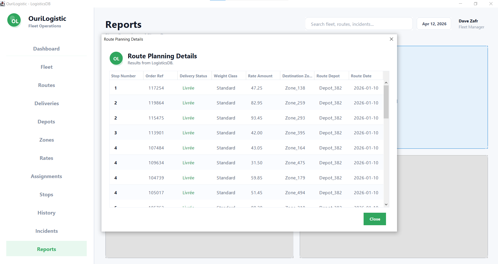

# DBProject - Stage E Report

## Application

Stage E implements a Java Swing desktop application named **OuriLogistic**.

The application connects to the PostgreSQL database `LogisticsDB` using JDBC and provides a graphical interface for the logistics database.

Connection used by the application:

```text
Host: localhost
Port: 5432
Database: LogisticsDB
User: postgres
```

## Tools

- Java Swing for the graphical interface
- JDBC for PostgreSQL connectivity
- PostgreSQL JDBC driver: `Shlav_E/lib/postgresql-42.7.11.jar`
- IntelliJ IDEA project/module structure
- PostgreSQL database from the previous project stages

## Main Screens

- Dashboard
- Fleet / Vehicles
- Routes
- Deliveries
- Depots
- Zones
- Rates
- Assignments
- Stops
- Status History
- Incidents
- Reports

## Table Access

The application provides access to all project tables:

- `depots`
- `delivery_zones`
- `delivery_rates`
- `vehicles`
- `vehicle_assignments`
- `delivery_routes`
- `deliveries`
- `route_stops`
- `delivery_status_history`
- `delivery_incidents`

Foreign keys are shown with readable values where relevant. For example, depot names, route names, order references, vehicle plates and zone names are displayed instead of raw IDs.

## CRUD

The application supports create, read, update and delete operations through the graphical screens.

Implemented CRUD screens:

- Vehicles
- Depots
- Routes
- Deliveries
- Incidents
- Zones
- Rates
- Vehicle Assignments
- Route Stops
- Delivery Status History

Delete operations show friendly validation messages when a row is still referenced by another table.

## Queries And Programs

The Reports screen runs:

- Stage B query: April transit incidents
- Stage B query: route planning details
- Stage D function: `fn_depot_workload`
- Stage D procedure: `prc_close_route`

## Running The Application

Open `Shlav_E` in IntelliJ and run:

```text
Shlav_E/src/Main.java
```

The PostgreSQL server must be running and the `LogisticsDB` database must already contain the project schema and data.

## Screenshots








