# Database Project - Logistics and Delivery Management System

**Student Names:** Ouriel and David
**Student IDs:** 1997912, 1741736

---

## Table of Contents
1. Introduction
2. Interface Mockups
3. Database Schemas (ERD & DSD)
4. Data Dictionary
5. Design Decisions
6. Data Insertion Methods
7. Backup

---

## 1. Introduction
This system was designed to manage the logistics department and delivery network of a company. The database stores and organizes information regarding warehouses (Depots), delivery zones, rate schedules, the vehicle fleet, drivers, and planned routes.
The main functionality of the system is to allow the administration to assign vehicles, plan routes, and perform precise, real-time tracking of delivery statuses and potential incidents.

## 2. Interface Mockups
The application screens were conceptualized using Google AI Studio to define user needs before creating the database.
*AI Studio Project Link :* https://aistudio.google.com/apps?source=user

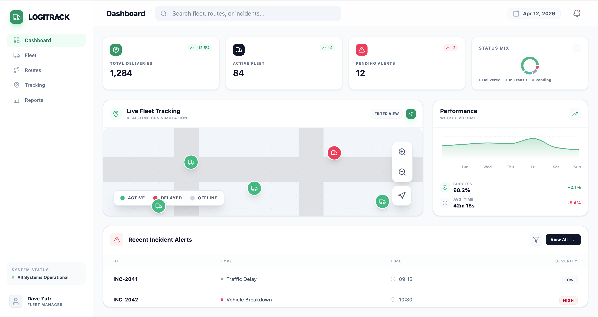
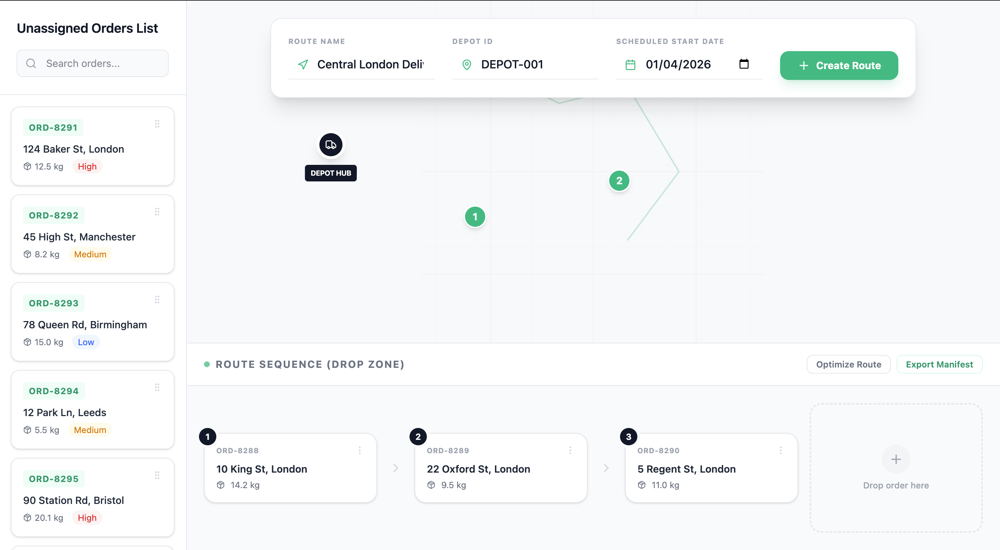
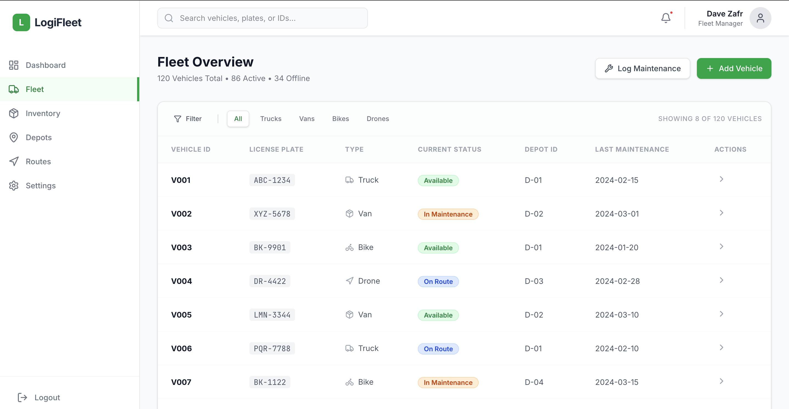
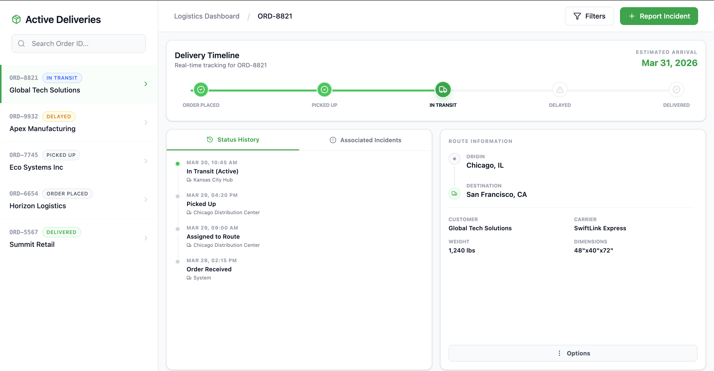

## 3. Database Schemas
### Entity-Relationship Diagram (ERD)

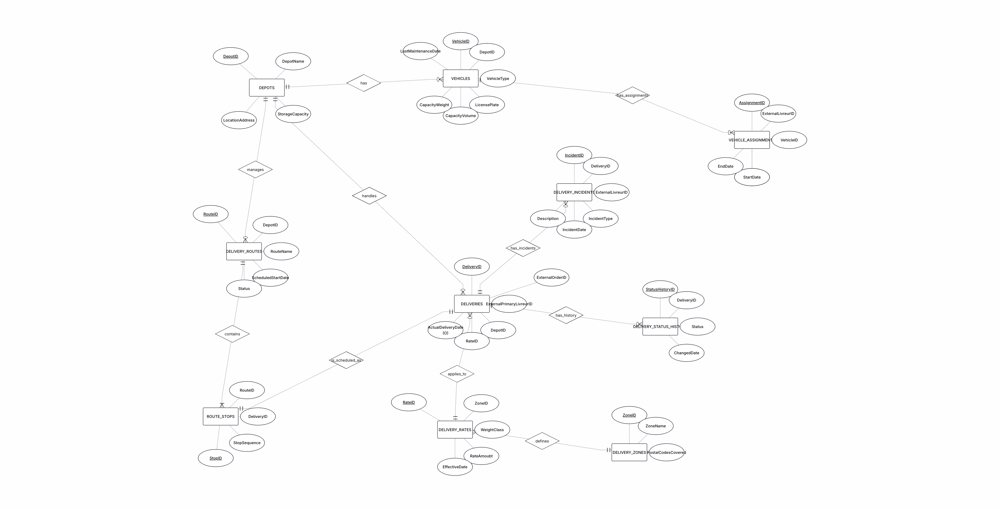

### Relational Schema (DSD)

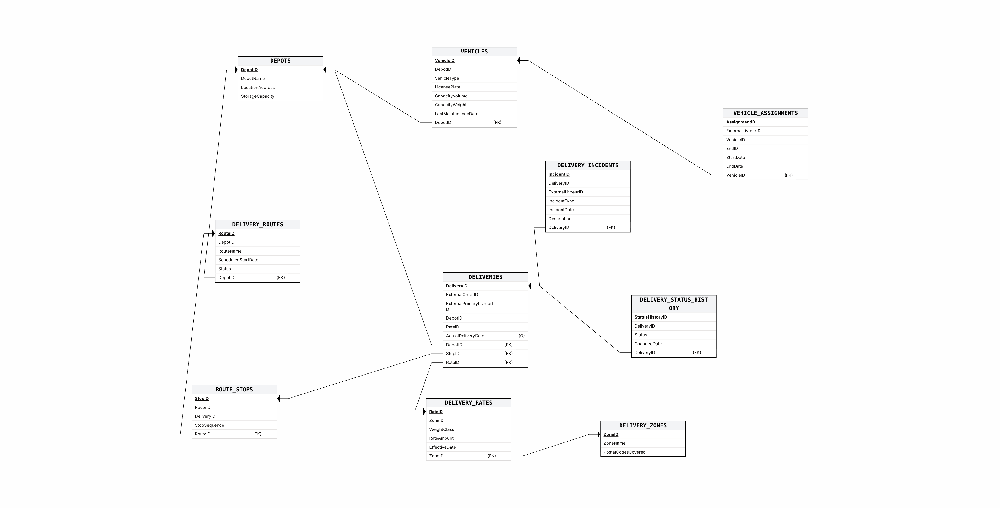

## 4. Data Dictionary

This section describes the main tables used in the delivery management database.

- **DEPOTS** Stores information about logistics warehouses, including their ID, name, address, and storage capacity.

- **DELIVERY_ZONES** Defines the geographic delivery zones based on postal codes.

- **DELIVERY_RATES** Contains the pricing rules applied according to the delivery zone and parcel weight.

- **VEHICLES** Represents the company’s physical fleet, such as trucks and scooters, including maintenance tracking information.

- **VEHICLE_ASSIGNMENTS** Keeps the history of vehicle assignments to external drivers.

- **DELIVERY_ROUTES** Manages the planning of delivery routes associated with a specific warehouse.

- **DELIVERIES** Central table that manages parcels and links them to rates, warehouses, and drivers.  
  Contains approximately **20,000 rows**.

- **ROUTE_STOPS** Stores the sequence of delivery stops for each route.  
  Contains approximately **20,000 rows**.

- **DELIVERY_STATUS_HISTORY** Maintains a detailed and timestamped history of all delivery status changes.

- **DELIVERY_INCIDENTS** Records unexpected events related to deliveries, such as delays or accidents.

## 5. Design Decisions
* **Data Historization:** We chose to isolate the status history (`DELIVERY_STATUS_HISTORY`) in a separate table. This allows for precise chronological tracking (Time-series) of a delivery's stages without cluttering the main `DELIVERIES` table.
* **Data Integrity:** We implemented strict constraints (`CHECK constraints`). For example, in the `VEHICLES` table, we restricted the vehicle types exclusively to the actual physical assets in our fleet (Camionnette, Scooter, Velo, Camion) to prevent any data entry errors.

## 6. Data Insertion Methods
In order to populate the database with realistic volumes (including over 20,000 records for the core tables), we used 3 distinct methods, in accordance with the guidelines:

**Method 1: Python script generating INSERT queries (For 8 main tables)**
We developed automated Python scripts that generate SQL files containing tens of thousands of `INSERT INTO` statements to massively populate the depots, vehicles, routes, deliveries, and status history tables.

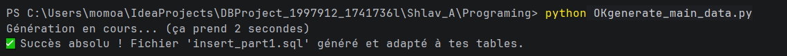

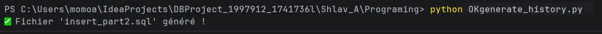

**Method 2: External data generator Mockaroo (For `DELIVERY_INCIDENTS`)**
To simulate random events, we generated 500 realistic incident records (Delays, Thefts, Accidents) via the external Mockaroo platform, and then exported and executed the resulting SQL script.

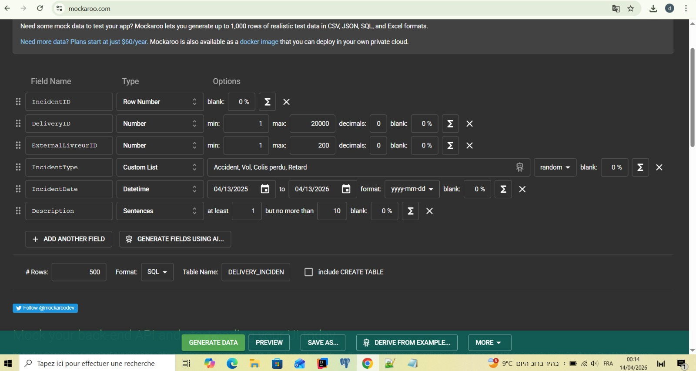

**Method 3: Native CSV Import via pgAdmin (For `VEHICLE_ASSIGNMENTS`)**
To demonstrate our ability to handle flat files, we wrote a Python script to generate a raw CSV file (`assignments.csv`) containing 500 records. We then imported this file directly into the database using pgAdmin's native Import/Export utility. To successfully bypass the strict Windows "Permission Denied" OS restrictions often encountered during this process, we strategically utilized the `C:\Users\Public` directory to ensure flawless native data ingestion.

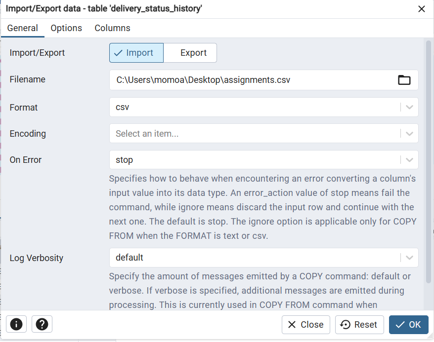

## 7. Backup
A full backup of the architecture and data (Plain SQL Dump) was successfully performed to validate the project's durability.

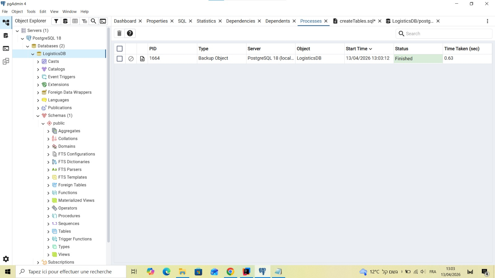