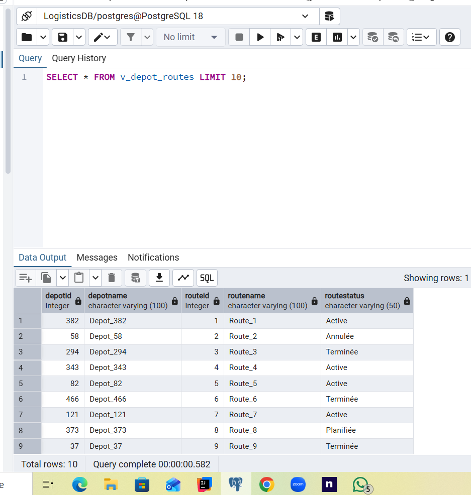
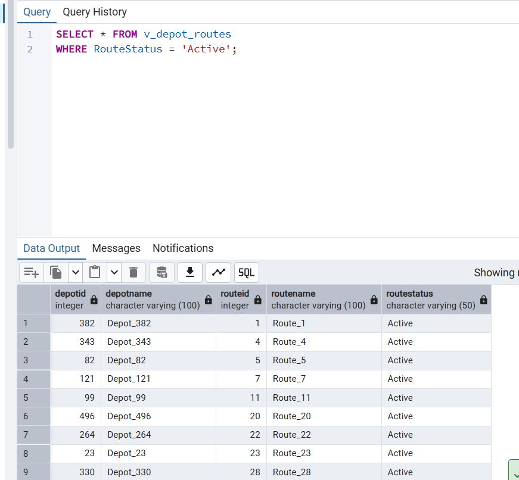
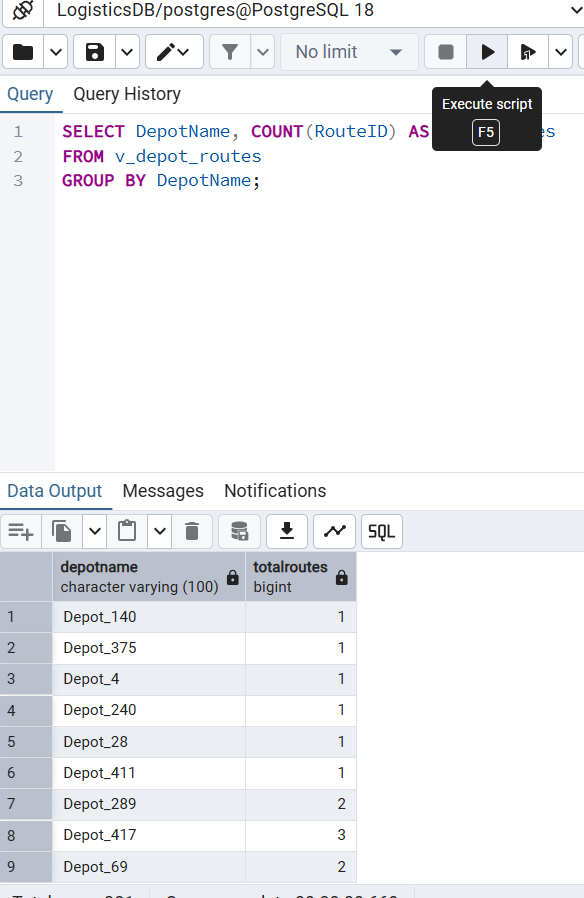
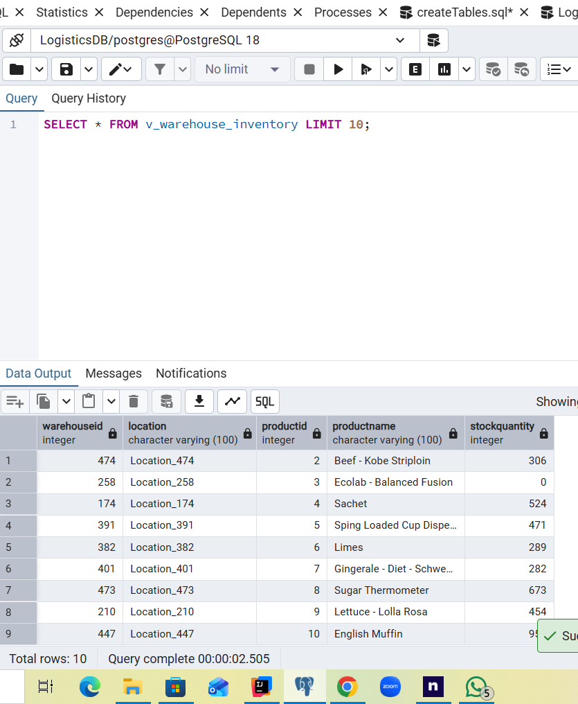
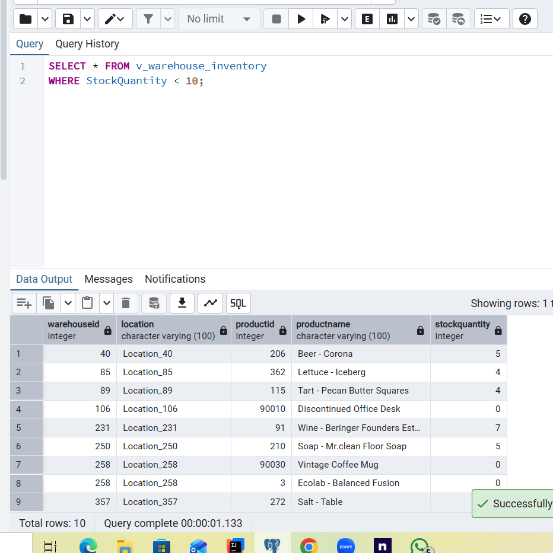
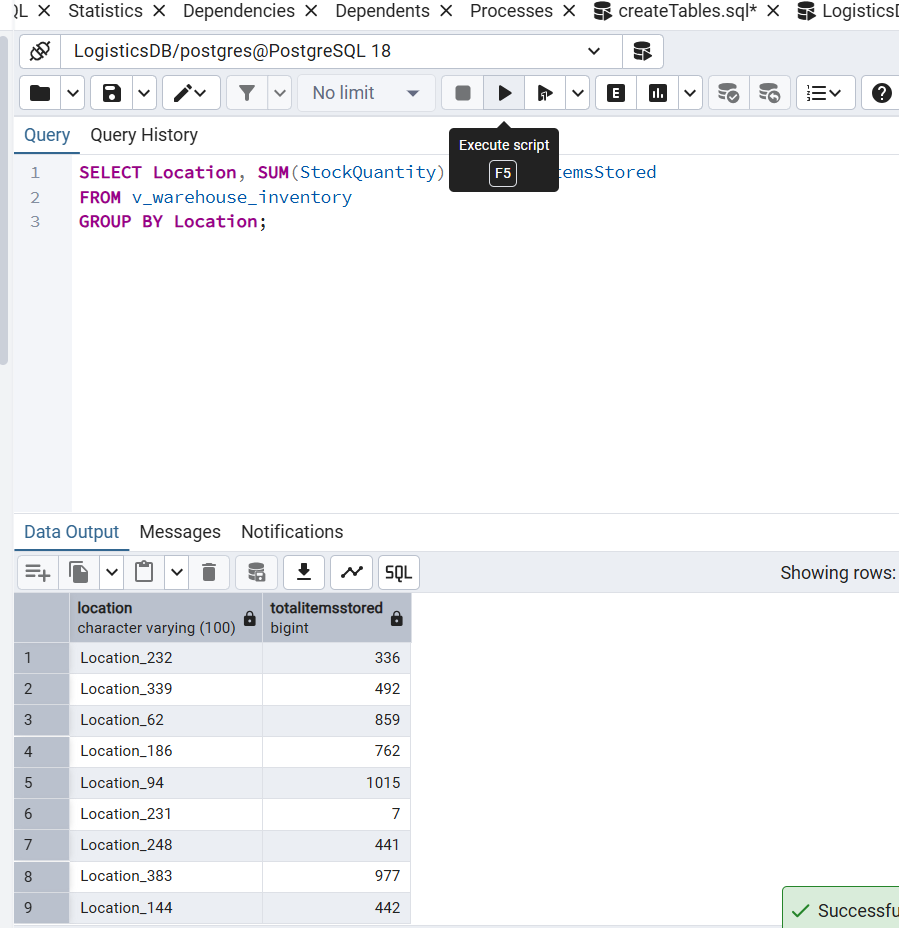
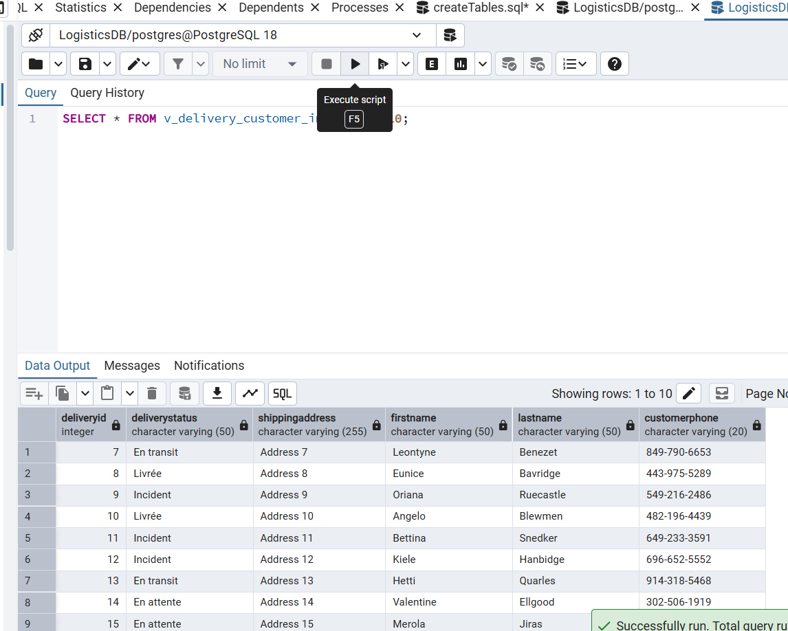
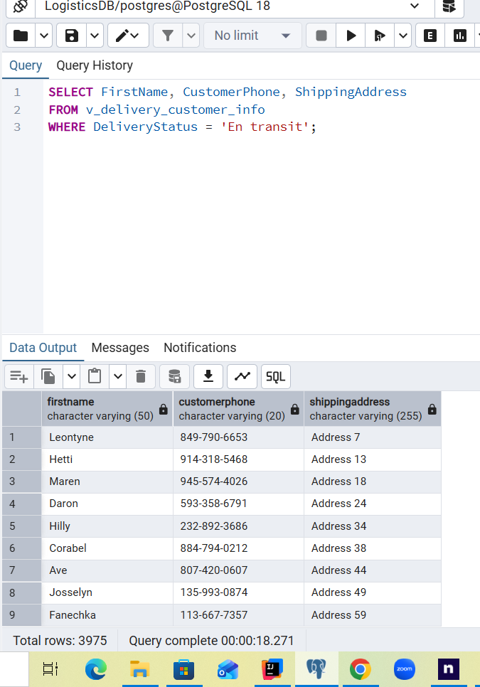
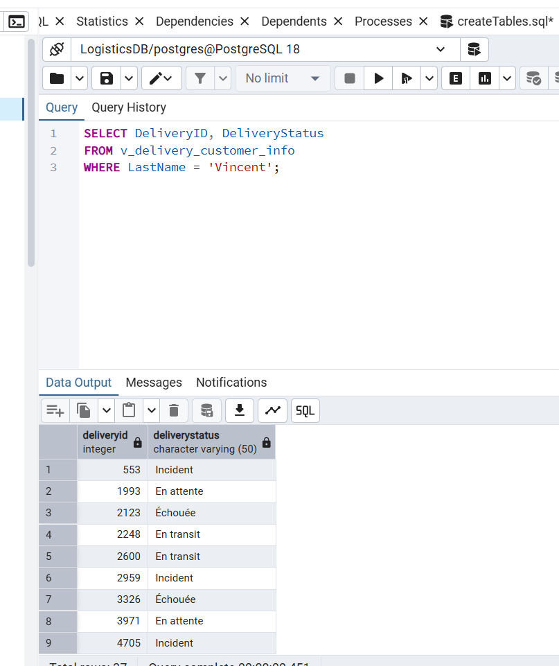

# Rapport du projet : Shlav C - Integration et vues

**Nom du projet original :** LogisticDB - gestion logistique et distribution  
**Nom du projet integre :** Shoppy - gestion de stock, clients et commandes

## 1. Decisions prises pendant l'integration

Dans ce stade, nous devions realiser une integration entre notre systeme logistique `LogisticDB`, gere localement avec PostgreSQL/PgAdmin, et le systeme du deuxieme groupe `Shoppy`, gere dans le cloud sur Supabase.

Nous avons choisi l'option 2 d'integration : **foreign tables**. Cette solution permet de garder les deux bases de donnees separees physiquement, tout en rendant les tables du systeme externe accessibles depuis notre base locale.

Notre partie de l'integration consiste donc a partir de notre base `LogisticDB` et a importer les tables du projet `Shoppy` comme tables etrangeres dans un schema local separe. De leur cote, l'autre equipe a fait l'integration inverse : depuis leur base Supabase, ils ont accede a notre base logistique locale. Comme notre base etait locale, ils ont utilise `ngrok` pour exposer temporairement leur acces TCP et permettre la connexion distante.

### 1.1 Choix de l'option 2 - Foreign Tables

Nous avons decide de ne pas faire de migration complete et de ne pas recopier toutes les donnees du projet Shoppy dans notre base. Les deux systemes gardent donc leur autonomie :

- `LogisticDB` reste responsable des depots, vehicules, routes, livraisons, stops, tarifs et incidents.
- `Shoppy` reste responsable des clients, commandes, produits, categories et informations commerciales.

Cette decision evite la duplication des donnees et permet une consultation en temps reel des informations distantes.

### 1.2 Utilisation de postgres_fdw

Pour connecter notre base locale a la base Supabase du groupe Shoppy, nous avons utilise l'extension PostgreSQL `postgres_fdw`. Cette extension permet a une base PostgreSQL de lire des tables situees dans une autre base PostgreSQL.

Contrairement au cote de l'autre equipe, notre connexion ne necessite pas `ngrok`, car nous nous connectons depuis notre base locale vers Supabase, qui possede deja une adresse reseau accessible.

### 1.3 Separation par schema dedie

Afin d'eviter les collisions de noms entre les tables locales et les tables importees, nous avons cree un schema separe appele `remote_shoppy`.

Les tables de notre projet restent dans le schema local habituel, par exemple :

- `DEPOTS`
- `DELIVERIES`
- `DELIVERY_ROUTES`
- `DELIVERY_INCIDENTS`

Les tables du projet Shoppy sont accessibles via le schema distant :

- `remote_shoppy.ORDERS`
- `remote_shoppy.CUSTOMERS`
- `remote_shoppy.PRODUCTS`
- `remote_shoppy.CATEGORIES`

Cette separation rend l'integration plus claire et evite de modifier les tables originales.

### 1.4 Lien logique entre les deux systemes

Le lien principal entre les deux projets se fait entre :

- `DELIVERIES.ExternalOrderID` dans notre base logistique ;
- `ORDERS.OrderID` dans la base Shoppy.

Ce lien permet d'associer une livraison locale a une commande du systeme Shoppy.

## 2. Explication du processus et des commandes dans Integrate.sql

Le fichier `Integrate.sql` contient les commandes permettant de connecter notre base locale au projet Shoppy heberge sur Supabase.

### 2.1 Nettoyage d'une ancienne integration

```sql
DROP SERVER IF EXISTS supabase_server CASCADE;
DROP SCHEMA IF EXISTS remote_shoppy CASCADE;
```

Ces commandes suppriment, si elles existent deja, l'ancien serveur distant et l'ancien schema `remote_shoppy`. Cela permet de relancer le script proprement sans conflit.

### 2.2 Activation de l'extension postgres_fdw

```sql
CREATE EXTENSION IF NOT EXISTS postgres_fdw;
```

Cette commande active le composant PostgreSQL necessaire pour travailler avec des tables etrangeres.

### 2.3 Creation du serveur distant Supabase

```sql
CREATE SERVER supabase_server
FOREIGN DATA WRAPPER postgres_fdw
OPTIONS (
        host 'aws-1-eu-west-1.pooler.supabase.com',
        port '5432',
        dbname 'postgres'
);
```

Cette commande definit le serveur distant. Elle contient l'adresse du serveur Supabase, le port et le nom de la base de donnees distante.

### 2.4 Creation du user mapping

```sql
CREATE USER MAPPING FOR postgres
SERVER supabase_server
OPTIONS (
        user 'postgres.jcqlmkuusqdxplazmfgz',
        password 'DBProject_1935279_214631426'
);
```

Cette commande indique les identifiants a utiliser pour que notre utilisateur local `postgres` puisse se connecter au serveur distant Supabase.

### 2.5 Creation du schema distant

```sql
CREATE SCHEMA remote_shoppy;
```

Ce schema sert de dossier logique pour stocker les foreign tables importees depuis Shoppy.

### 2.6 Import des tables distantes

```sql
IMPORT FOREIGN SCHEMA public
FROM SERVER supabase_server
INTO remote_shoppy;
```

Cette commande lit la structure des tables du schema `public` de Supabase et cree dans `remote_shoppy` des foreign tables. Les donnees restent physiquement dans Supabase, mais nous pouvons les interroger depuis notre base locale.

### 2.7 Test de connexion

```sql
SELECT * FROM remote_shoppy.categories LIMIT 5;
```

Cette requete permet de verifier que l'import a fonctionne et que les tables distantes sont accessibles.

**Capture a inserer :** resultat de la requete de test sur `remote_shoppy.categories`.

## 3. Vues et requetes

Le fichier `Views.sql` contient trois vues :

1. une vue locale du point de vue de `LogisticDB` ;
2. une vue distante du point de vue de `Shoppy` ;
3. une vue integree combinant les deux systemes.

Chaque vue est accompagnee de deux requetes significatives.

## 4. Vue 1 - Point de vue LogisticDB

**Nom du view :** `v_depot_routes`

### Description

Cette vue represente le point de vue de notre systeme logistique. Elle combine les depots avec les routes de livraison afin de savoir quelles routes sont gerees par chaque depot et quel est le statut de chaque route.

### Code de creation du view

```sql
CREATE OR REPLACE VIEW v_depot_routes AS
SELECT
    dp.DepotID,
    dp.DepotName,
    r.RouteID,
    r.RouteName,
    r.Status AS RouteStatus
FROM DEPOTS dp
         JOIN DELIVERY_ROUTES r ON dp.DepotID = r.DepotID;
```

### Verification du view

```sql
SELECT * FROM v_depot_routes LIMIT 10;
```

**

### Requete 1.1 - Routes actives

**Description :** cette requete affiche uniquement les routes actuellement actives. Elle peut etre utilisee par le gestionnaire logistique pour suivre les tournees en cours.

```sql
SELECT * FROM v_depot_routes
WHERE RouteStatus = 'Active';
```

**

### Requete 1.2 - Nombre de routes par depot

**Description :** cette requete compte le nombre total de routes gerees par chaque depot.

```sql
SELECT DepotName, COUNT(RouteID) AS TotalRoutes
FROM v_depot_routes
GROUP BY DepotName;
```

**

## 5. Vue 2 - Point de vue Shoppy

**Nom du view :** `v_warehouse_inventory`

### Description

Cette vue represente le point de vue du systeme Shoppy. Elle affiche l'inventaire des produits par entrepot. Elle permet de suivre les produits disponibles et d'identifier les stocks faibles.

### Code de creation du view

```sql
CREATE OR REPLACE VIEW v_warehouse_inventory AS
SELECT
    w.WarehouseID,
    w.Location,
    p.ProductID,
    p.ProductName,
    p.StockQuantity
FROM remote_shoppy.WAREHOUSES w
         JOIN remote_shoppy.PRODUCTS p ON w.WarehouseID = p.WarehouseID;
```

### Verification du view

```sql
SELECT * FROM v_warehouse_inventory LIMIT 10;
```

**

### Requete 2.1 - Produits avec stock faible

**Description :** cette requete affiche les produits dont la quantite disponible est inferieure a 10. Elle peut aider a declencher un reapprovisionnement.

```sql
SELECT * FROM v_warehouse_inventory
WHERE StockQuantity < 10;
```

**

### Requete 2.2 - Total du stock par entrepot

**Description :** cette requete calcule le nombre total d'articles stockes dans chaque entrepot.

```sql
SELECT Location, SUM(StockQuantity) AS TotalItemsStored
FROM v_warehouse_inventory
GROUP BY Location;
```

**

## 6. Vue 3 - Vue integree LogisticDB + Shoppy

**Nom du view :** `v_delivery_customer_info`

### Description

Cette vue est la vue integree principale. Elle relie nos livraisons locales aux commandes et clients du systeme Shoppy. Le lien se fait entre `DELIVERIES.ExternalOrderID` et `remote_shoppy.ORDERS.OrderID`.

Cette vue permet d'obtenir, pour une livraison, le statut logistique, l'adresse de livraison et les informations de contact du client.

### Code de creation du view

```sql
CREATE OR REPLACE VIEW v_delivery_customer_info AS
SELECT
    d.DeliveryID,
    d.Status AS DeliveryStatus,
    o.ShippingAddress,
    c.FirstName,
    c.LastName,
    c.Phone AS CustomerPhone
FROM DELIVERIES d
         JOIN remote_shoppy.ORDERS o ON d.ExternalOrderID = o.OrderID
         JOIN remote_shoppy.CUSTOMERS c ON o.CustomerID = c.CustomerID;
```

### Verification du view

```sql
SELECT * FROM v_delivery_customer_info LIMIT 10;
```

**

### Requete 3.1 - Contacts des livraisons en transit

**Description :** cette requete affiche les informations de contact des clients dont la livraison est actuellement en transit. Elle est utile pour un livreur ou un service de suivi.

```sql
SELECT FirstName, CustomerPhone, ShippingAddress
FROM v_delivery_customer_info
WHERE DeliveryStatus = 'En transit';
```

**

### Requete 3.2 - Recherche par nom de client

**Description :** cette requete permet de retrouver les livraisons associees a un client specifique. Dans l'exemple, on cherche le client dont le nom de famille est `Vincent`.

```sql
SELECT DeliveryID, DeliveryStatus
FROM v_delivery_customer_info
WHERE LastName = 'Vincent';
```

**

## 7. Verification des tables importees

Avant de prendre les captures finales, il est important de verifier les noms exacts des tables et colonnes importees depuis Supabase.

### Liste des foreign tables importees

```sql
SELECT foreign_table_schema, foreign_table_name
FROM information_schema.foreign_tables
WHERE foreign_table_schema = 'remote_shoppy'
ORDER BY foreign_table_name;
```

### Liste des colonnes importees

```sql
SELECT table_name, column_name, data_type
FROM information_schema.columns
WHERE table_schema = 'remote_shoppy'
ORDER BY table_name, ordinal_position;
```

Ces requetes permettent de confirmer que les noms utilises dans `Views.sql` correspondent exactement au schema Shoppy.

## 8. Conclusion

Dans ce stade, nous avons integre notre base `LogisticDB` avec la base distante `Shoppy` en utilisant l'option 2, c'est-a-dire les foreign tables.

L'integration a ete realisee avec `postgres_fdw`, un serveur distant `supabase_server`, un schema dedie `remote_shoppy`, et l'import du schema public de Supabase. Cette solution garde les deux systemes independants tout en permettant d'ecrire des vues communes.

Les vues creees montrent trois perspectives : la perspective logistique locale, la perspective commerciale distante, et une perspective integree reliant les livraisons aux commandes et aux clients.
