# Project Report - Stage D

## 1. Goal

Stage D adds non-trivial PL/pgSQL programming to the integrated logistics database from Stage C.

Important decision: no new project tables, columns or sequences were added. The programs are based on the existing schema:

- `depots`
- `deliveries`
- `delivery_routes`
- `route_stops`
- `delivery_status_history`
- `delivery_incidents`

The submission contains:

- 2 functions
- 2 procedures
- 2 triggers, including one trigger on `UPDATE`
- 2 main SQL programs, each calling one function and one procedure
- `AlterTable.sql`, kept only to document that no table changes were required

## 2. Execution Order

Run the files in this order:

```sql
\i function_depot_workload.sql
\i function_open_problem_deliveries.sql
\i procedure_close_route.sql
\i procedure_mark_low_stock_deliveries_incident.sql
\i trigger_delivery_status_history.sql
\i trigger_depot_capacity_guard.sql
```

Then run the main programs:

```sql
\i main_close_route_program.sql
\i main_low_stock_program.sql
```

## 3. AlterTable.sql

No schema change is needed for this stage.

`AlterTable.sql` contains only a comment explaining that the programs use the existing Stage C database structure.

## 4. Function: fn_depot_workload

File: `function_depot_workload.sql`

Description: receives a depot id and calculates its workload according to the statuses of its deliveries. It uses records, an implicit cursor loop, conditions and exception handling.

Example:

```sql
SELECT * FROM fn_depot_workload(1);
```

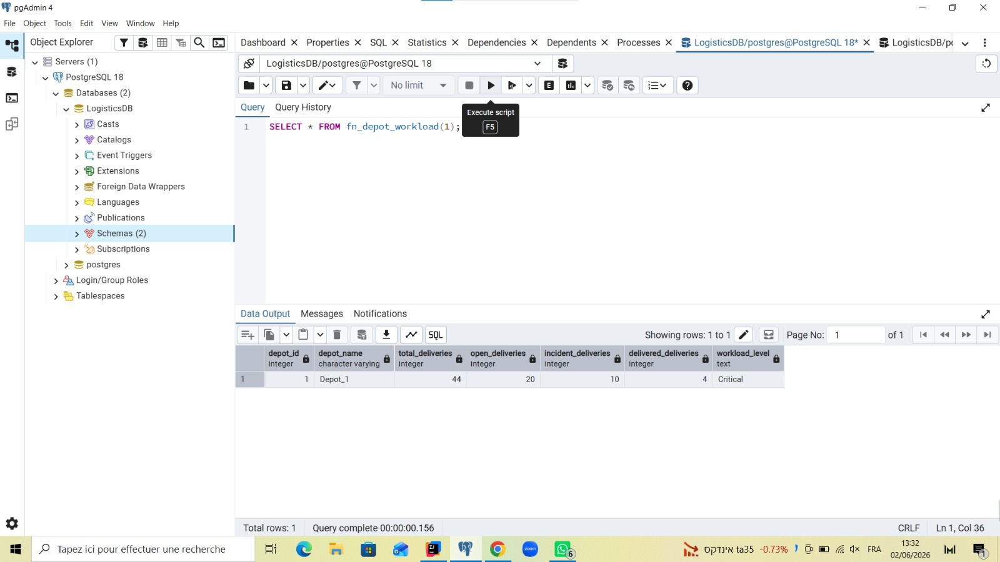

Exception proof:

```sql
SELECT * FROM fn_depot_workload(-1);
```

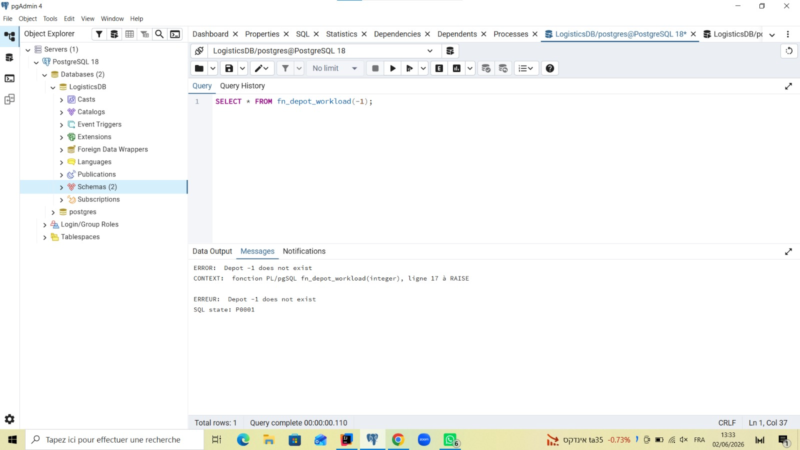

## 5. Function: fn_open_problem_deliveries

File: `function_open_problem_deliveries.sql`

Description: returns a `refcursor` containing old open/problematic deliveries. It validates the input and opens a cursor over delivery history data.

Example:

```sql
BEGIN;
SELECT fn_open_problem_deliveries(7);
FETCH 10 FROM problem_deliveries_cursor;
CLOSE problem_deliveries_cursor;
COMMIT;
```

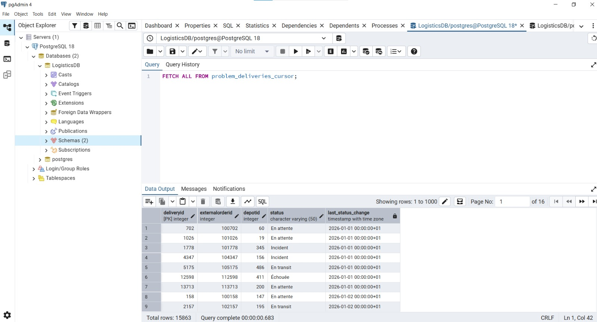


Exception proof:

```sql
SELECT fn_open_problem_deliveries(-1);
```


## 6. Procedure: prc_close_route

File: `procedure_close_route.sql`

Description: receives a route id, checks that the route exists and is open, iterates over its stops with an explicit cursor, updates related deliveries to delivered, and closes the route.

Example:

```sql
CALL prc_close_route(1);

SELECT routeid, status
FROM delivery_routes
WHERE routeid = 1;

SELECT deliveryid, status, actualdeliverydate
FROM deliveries
WHERE deliveryid IN (
    SELECT deliveryid FROM route_stops WHERE routeid = 1
);
```

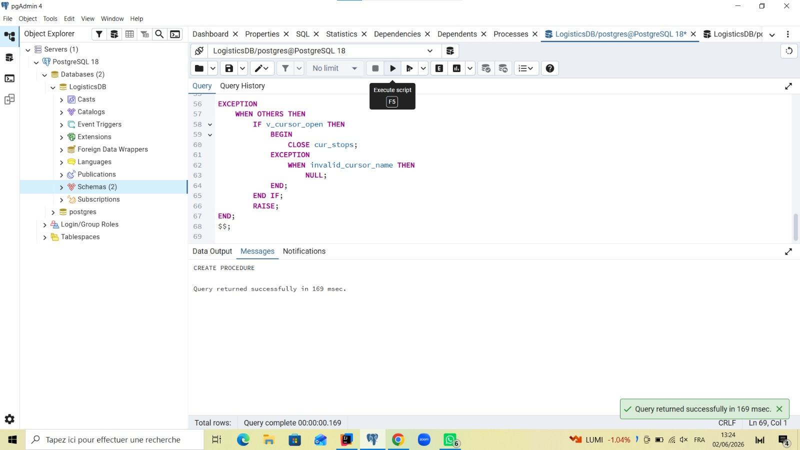

BEFORE :
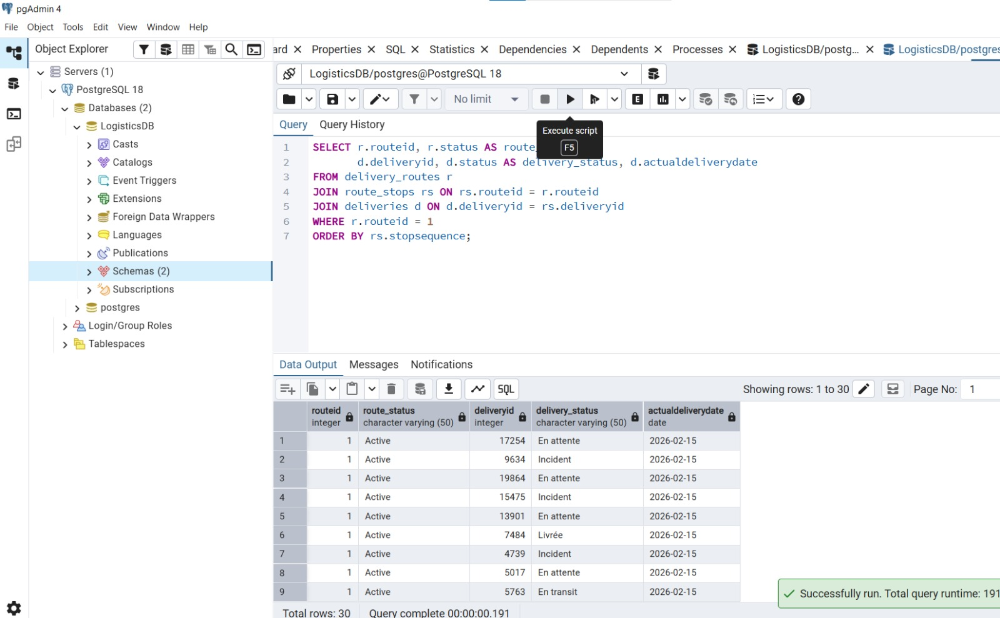

AFTER :
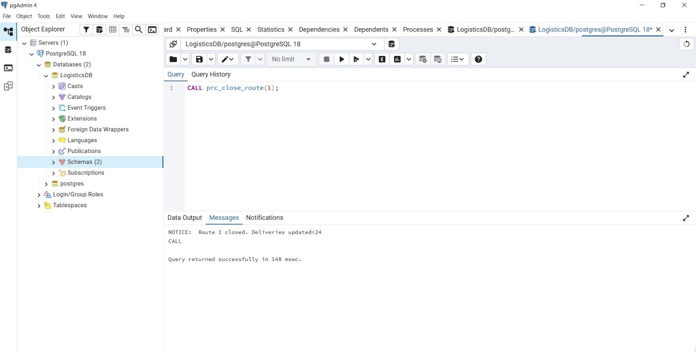
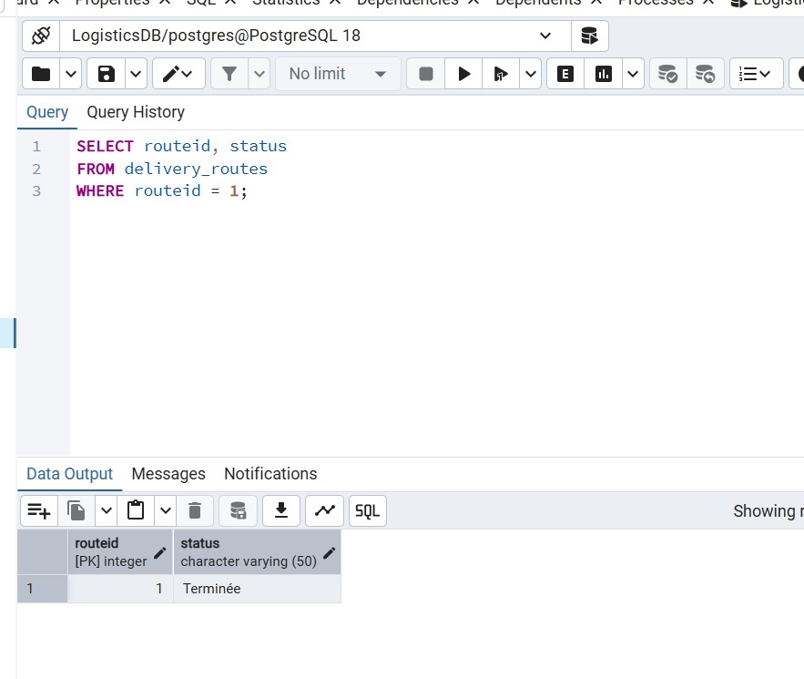
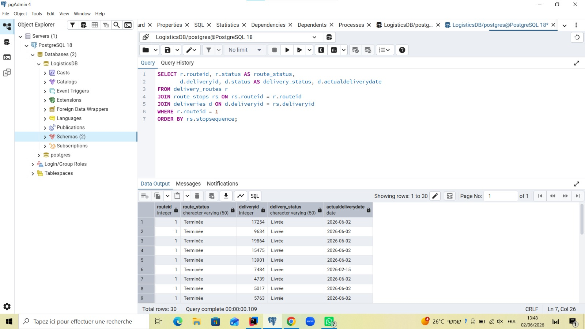


## 7. Procedure: prc_mark_low_stock_deliveries_incident

File: `procedure_mark_low_stock_deliveries_incident.sql`

Description: checks old/problematic deliveries using the existing local tables `deliveries` and `delivery_status_history`. If a delivery is still not successfully delivered after the chosen number of days, the delivery becomes `Incident` and a row is inserted into `delivery_incidents`.

Example:

```sql
CALL prc_mark_low_stock_deliveries_incident(0);

SELECT deliveryid, status
FROM deliveries
WHERE status = 'Incident'
ORDER BY deliveryid
LIMIT 10;

SELECT *
FROM delivery_incidents
WHERE incidenttype = 'Delayed delivery escalation'
ORDER BY incidentid DESC
LIMIT 5;
```

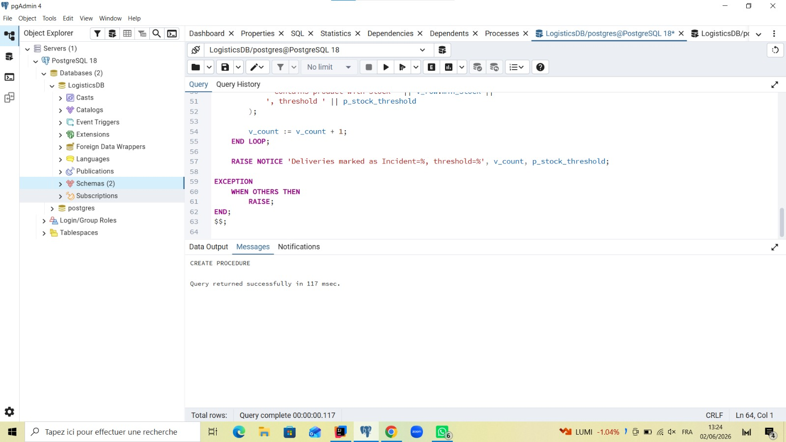

## 8. Trigger: trg_delivery_status_history

File: `trigger_delivery_status_history.sql`

Description: `AFTER UPDATE OF status ON deliveries`. Whenever a delivery status changes, it inserts the new status into the existing `delivery_status_history` table.

Verification:

```sql
UPDATE deliveries
SET status = 'En transit'
WHERE deliveryid = 1
  AND status <> 'En transit';

SELECT *
FROM delivery_status_history
WHERE deliveryid = 1
ORDER BY statushistoryid DESC;
```

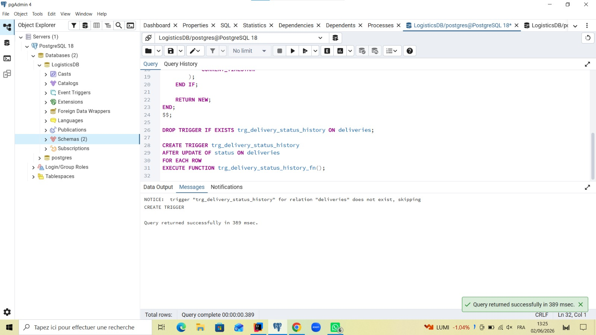

## 9. Trigger: trg_depot_capacity_guard

File: `trigger_depot_capacity_guard.sql`

Description: `BEFORE UPDATE OF storagecapacity ON depots`. It blocks invalid non-positive capacity updates using an exception. It also prints a notice when capacity is reduced by more than 50 percent.

Verification:

```sql
UPDATE depots
SET storagecapacity = storagecapacity + 100
WHERE depotid = 1;
```
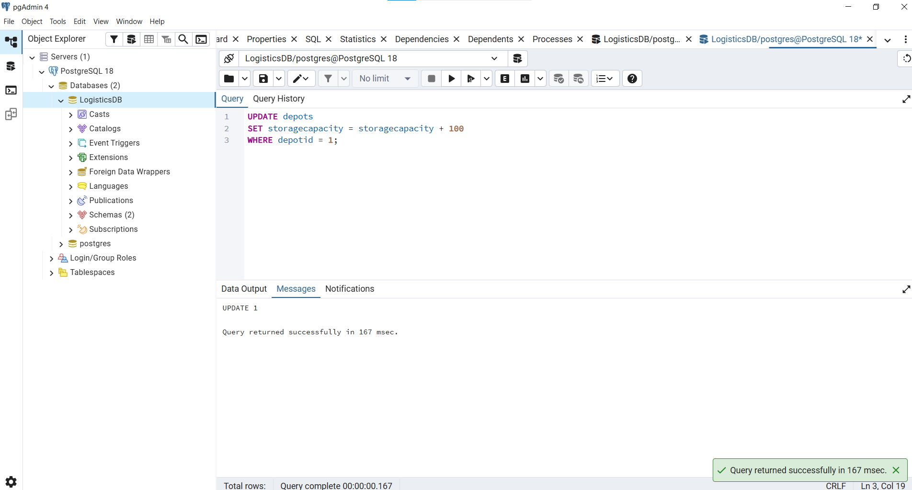

Exception proof:

```sql
UPDATE depots
SET storagecapacity = -1
WHERE depotid = 1;
```
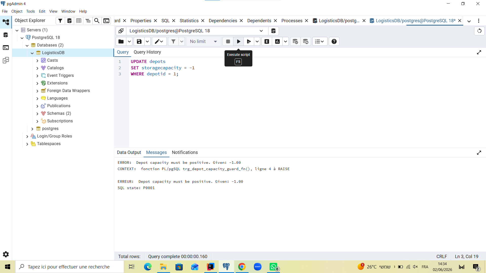

## 10. Main Program 1

File: `main_close_route_program.sql`

Description: selects one planned/active route, calls `fn_depot_workload` for its depot, prints the workload with `RAISE NOTICE`, then calls `prc_close_route`.

Proof:

```sql
\i main_close_route_program.sql
```

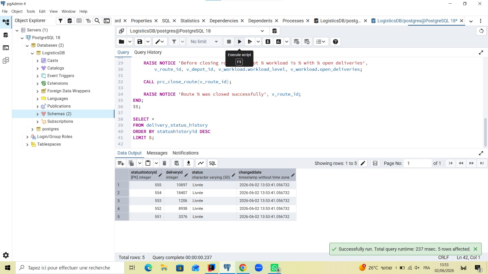

## 11. Main Program 2

File: `main_low_stock_program.sql`

Description: opens the `refcursor` from `fn_open_problem_deliveries`, previews up to five problematic deliveries with `RAISE NOTICE`, closes the cursor, then calls `prc_mark_low_stock_deliveries_incident`.

## 12. Backup and Git Tag

After verifying the programs, create the required updated backup named `backup4`, place it in `Shlav_D`, then create a git tag:

```bash
git tag stage-d
git push origin stage-d
```
